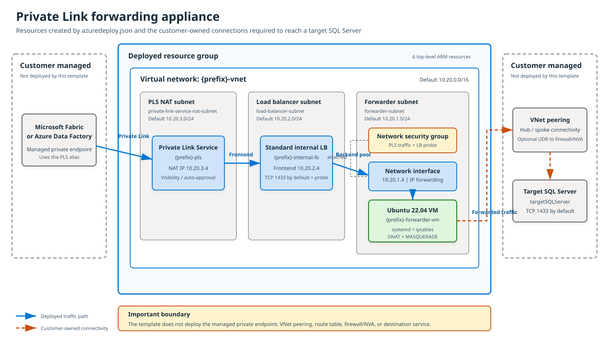

# Private Link forwarding appliance ARM template

[](https://portal.azure.com/#create/Microsoft.Template/uri/https%3A%2F%2Fraw.githubusercontent.com%2FAzureGovGuy%2Farm-pls-appliance%2Fmain%2Fazuredeploy.json)

This resource-group-scoped ARM template deploys the provider side of a Private Link connection:

- One virtual network with three dedicated subnets
- One Standard internal load balancer
- One Flexible-orchestration virtual machine scale set of Ubuntu forwarding instances with IP forwarding enabled
- One Private Link Service attached to the load balancer frontend
- NSG rules for Private Link Service traffic and load-balancer health probes, with an explicit inbound deny floor
- Reboot-persistent DNAT, SNAT and forwarding rules managed by systemd and declared in `cloud-init/forwarder.yaml`
- Application Health monitoring plus automatic instance repair
- Optionally, a NAT gateway for outbound internet from the forwarder subnet

The template does not create Fabric, Azure Data Factory, a managed private endpoint, hub peering, a route table, or the destination service. Those remain customer-owned integration steps.

## Architecture

[](architecture.svg)

## Traffic path

```text
Fabric or ADF managed private endpoint
  -> Private Link Service
  -> Standard internal load balancer
  -> forwarding instance (scale set)
  -> peered hub/spoke network
  -> targetSQLServer:targetPort
```

`targetSQLServer` is the private IPv4 address of the destination SQL Server, including an on-premises server reached through ExpressRoute or a site-to-site VPN. The forwarding instances apply both DNAT and MASQUERADE. SQL Server sees the source as a forwarding instance private IP. The server must be reachable from the appliance VNet after the customer creates peering and any required hub routes or firewall rules.

## Why a scale set rather than a single VM

The [Azure Data Factory tutorial](https://learn.microsoft.com/en-us/azure/data-factory/tutorial-managed-virtual-network-on-premise-sql-server) this pattern derives from states plainly:

> "The configuration within the virtual machine (VM) isn't permanent. This means that each time the VM restarts, it requires reconfiguration."

That produces the worst available failure mode. A rebooted forwarder answers SSH, so a liveness probe reports it healthy, it stays in the backend pool, and it blackholes every connection. Nothing in the chain reports a fault; Fabric simply times out.

This template closes that gap structurally rather than by hand:

| Defect | How it is resolved here |
| --- | --- |
| Rules lost on reboot | `cloud-init/forwarder.yaml` installs a systemd unit that rebuilds the rules at every boot, not once at provisioning time |
| Rules lost to drift or manual edits | A systemd timer reconciles every five minutes, and repairs only when it detects drift so live rules are never torn down needlessly |
| Broken instance stays in the pool | The Application Health extension reports the real verdict and automatic instance repair replaces the instance |
| Probe proves only that the VM booted | The load-balancer probe is DNAT'd to the target exactly like production traffic, so it tests the whole path |
| Single VM is a single point of failure | Instances are spread across availability zones |
| B-series has no accelerated networking | D-series with accelerated networking enabled, which matters because this workload is packet-forwarding bound rather than CPU bound |

### Health checking is deliberately split in two

The load balancer and the scale set answer different questions, and Flexible orchestration forces them apart.

The **load-balancer probe** targets `targetPort`. Because the DNAT rule matches probe traffic like any other, that probe traverses the full path to the real SQL Server. It decides whether an instance receives traffic.

The **Application Health extension** probes a loopback-only endpoint on `healthPort` that answers two independent questions: are the forwarding rules actually installed right now, and is the target actually accepting TCP right now. It decides whether an instance is replaced. Both must be checked, because the target reachability test is locally originated and therefore traverses `OUTPUT` rather than the DNAT rules in `PREROUTING`.

Using the extension is not a preference. Load-balancer health probes cannot drive instance repair in Flexible orchestration; [the documented unsupported parameter list](https://learn.microsoft.com/en-us/azure/virtual-machine-scale-sets/virtual-machine-scale-sets-orchestration-modes) is explicit:

> Application health via SLB health probe - use Application Health Extension on instances

Because the endpoint binds to `127.0.0.1`, it is never reachable from the VNet and needs no NSG rule.

## Outbound internet is not required

`enableInternetEgress` defaults to `false`, and the appliance is designed so that this is a real option rather than a broken one:

- **The data path never uses it.** Traffic to on-premises follows peering and BGP-learned routes, which are more specific than the default route.
- **The cloud-init installs nothing.** `iptables`, `systemd` and `bash` all ship in the Azure Ubuntu marketplace image, so first boot needs no package feed.
- **Extensions still install.** Per [virtual machine extensions for Linux](https://learn.microsoft.com/en-us/azure/virtual-machines/extensions/features-linux), a supported Azure Linux Agent redirects extension downloads through the fabric controller on `168.63.129.16` rather than Azure Storage. Note the documented trade-off: without access to `*.blob.windows.net`, agent initialization and extension installation *"incurs more delays"*.

Set `enableInternetEgress` to `true` to add a NAT gateway when you need in-guest OS patching, which is the one capability genuinely lost without egress. Doing so also switches `patchMode` to `AutomaticByPlatform`.

Note that scale sets in Flexible orchestration have **no default outbound access**, and platform default outbound access retired in September 2025. There is no implicit internet path to fall back on.

## Deploy

Select the intended Azure commercial subscription first:

```powershell
az cloud set --name AzureCloud
az account set --subscription <subscription-id>
```

Run the helper script with an existing SSH public key:

```powershell
./deploy.ps1 `
  -ResourceGroupName rg-customer-pls-lab `
  -Location eastus2 `
  -TargetSQLServer 10.40.1.4 `
  -TargetPort 1433 `
  -AdminSshPublicKey (Get-Content ~/.ssh/id_ed25519.pub -Raw) `
  -ConsumerSubscriptionIds <fabric-or-adf-subscription-id>
```

Add `-WhatIf` to preview the change set, `-InstanceCount` to size the fleet, and `-EnableInternetEgress` to add the NAT gateway. Add `-AutoApproveConsumers` only when private endpoint requests from every listed consumer subscription should be approved automatically. Otherwise, approve each connection on the deployed Private Link Service.

Alternatively, replace placeholders in `azuredeploy.parameters.json` and run:

```powershell
az deployment group create `
  --resource-group rg-customer-pls-lab `
  --template-file azuredeploy.json `
  --parameters '@azuredeploy.parameters.json'
```

## Editing the instance configuration

`cloud-init/forwarder.yaml` is the source of truth. `azuredeploy.json` carries an embedded copy so the template stays self-contained and portal-deployable.

```powershell
./tools/Build-Template.ps1           # re-embed after editing the YAML
./tools/Build-Template.ps1 -Verify   # fail if the template has drifted
```

`deploy.ps1` runs the verify step automatically and refuses to deploy a template whose embedded configuration disagrees with the reviewed YAML.

The forwarding logic can be exercised without Azure. `tools/Test-Forwarder.sh` stubs `iptables` with a state machine and drives the real scripts through apply, idempotency, drift repair, flush and both health-endpoint branches. It needs `bash`, `python` and `pyyaml`:

```bash
./tools/Test-Forwarder.sh /path/to/rendered-cloud-init.yaml
```

On the instances themselves:

```bash
sudo private-link-forwarder status    # show the installed rules
sudo private-link-forwarder verify    # exit non-zero if anything is missing
sudo systemctl status private-link-forwarder.service
curl -s http://127.0.0.1:8080/healthz
```

## Connect Fabric or ADF

1. Copy the `privateLinkServiceAlias` deployment output.
2. In Fabric or ADF, create a managed private endpoint targeting that alias or the `privateLinkServiceId`, depending on the product workflow.
3. Approve the pending private endpoint connection on the Private Link Service unless auto-approval was enabled.
4. Test the configured TCP port from the managed environment.

This template exposes one TCP port. The instance-side forwarding table at `/etc/private-link-forwarder/forward.map` accepts additional `listenPort targetHost targetPort` records, but each extra port also needs a matching load-balancing rule, probe and NSG rule in the template.

## Peer to a hub

Before deployment, set `vnetAddressPrefix` and all subnet prefixes to ranges that do not overlap the customer hub, target VNet, or any transit network. Azure VNet peering rejects overlapping address spaces.

Create bidirectional VNet peering between the deployed `virtualNetworkId` output and the customer hub. Enable forwarded traffic on both peerings because the instances forward packets whose source and destination are not their own address.

If the hub uses Azure Firewall or another NVA, associate a customer-owned route table with `forwarder-subnet` so the target prefix uses that appliance as the next hop. Do **not** place a route table on the load balancer or PLS NAT subnets; steering those breaks the Private Link return path. Ensure the return path can reach the forwarder subnet. The MASQUERADE rule reduces the return-route requirement to the deployed VNet address space rather than the Fabric or ADF managed VNet.

### Allow-listing on the target

Scale set instances take **dynamic** addresses, so there is no stable per-instance IP to allow-list. Allow the whole `forwarderSubnetPrefix`, which the template emits as a deployment output. The default is a `/27` specifically to keep that firewall change request narrow while leaving room to scale out.

## Operational notes

- No public IP is assigned to the instances. Admin access must come through the customer's private network, Azure Run Command, or by setting `adminSourceAddressPrefix` to a private CIDR.
- The load-balancer probe reaches the configured target port through a forwarding instance. A failed downstream target makes the backend unhealthy, which is intended.
- Linux rules are recreated at every boot by `private-link-forwarder.service` and reconciled every five minutes by `private-link-forwarder-reconcile.timer`.
- Autoscale is deliberately not configured. Azure Load Balancer does not drain TCP connections, so a scale-in during a Spark job holding a JDBC connection open kills that read mid-flight. Change `instanceCount` explicitly instead.
- MASQUERADE consumes one source port per concurrent flow toward the same target tuple. Spark with a high JDBC `numPartitions` opens many parallel connections, so ephemeral port range and conntrack limits are raised in cloud-init; adding instances adds source ports.
- The Private Link Service idles at roughly five minutes. Set TCP keepalives below 300 seconds in client connection properties; the appliance is a pure L4 NAT and cannot keep the session alive on the client's behalf.
- Instances use trusted launch, so `imageReference` must remain a generation 2 image.
